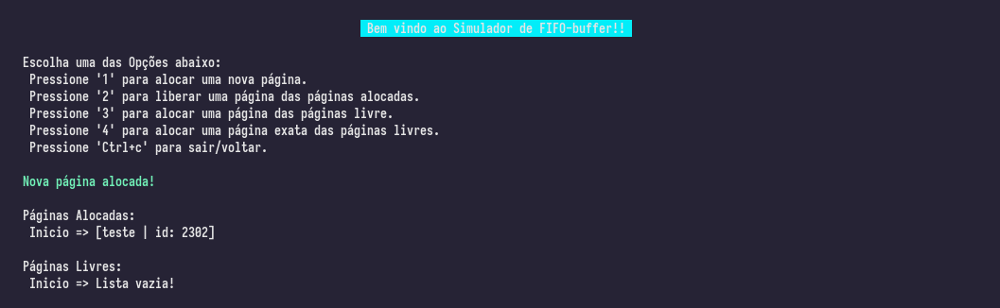

# FIFO-buffer
### instabilidade no remove do collections::LinkedList
``` rust
#![feature(linked_list_remove)]// `#![feature]` may not be used on the stable release channel
```
### Instalando e executando um canal instável
```bash
rustup install nightly
cargo +nightly install racer
cargo +nightly test
cargo +nightly run
```

### Preview
